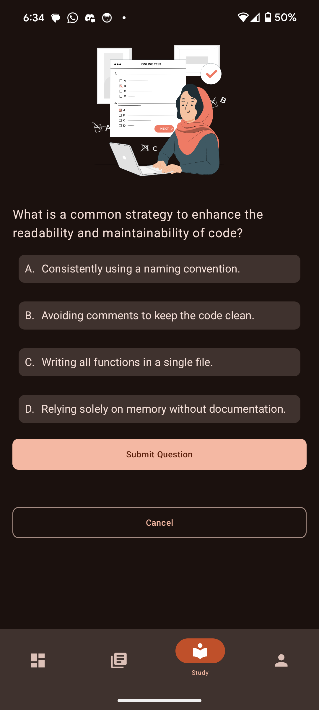
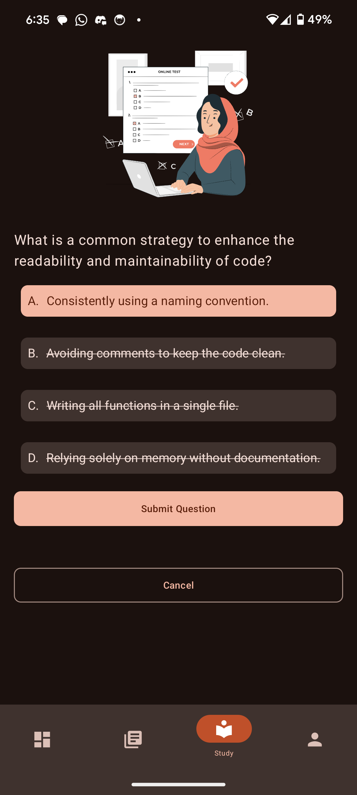

# LearnFlex

LearnFlex is a cross-platform application designed to provide an interactive learning experience. It leverages artificial intelligence to
personalize learning paths and integrates various APIs to enrich content. This platform specifically targets `Android` and `Desktop JVM`
(preferably Windows 64-bit) environments.

## 1. **Installation Guide**
1. Clone the Repository
    - Download or clone the project’s repository from GitHub. Use either the command line (git clone <REPO_URL>) or GitHub Desktop.
2. Open the Project
    - Use `IntelliJ IDEA` to open the LearnFlex project.
    - Let the IDE sync Gradle dependencies. (This might take a moment.)
3. Create local.properties
    - In the root directory of the project, create a file named `local.properties`.
    - Open the file and paste the API keys provided in the confidential document you received. This ensures that any required services (
      e.g.,
      OpenAI, Firebase) have the correct credentials.
   

        
    

4. Add google-services.json
    - Navigate to the composeApp folder in your project, which you can find at composeApp/.
   - Create a file called `google-services.json` in that folder.
    - Copy and paste the entire JSON content from the same confidential document you received into this file.
    - If you have misplaced the document or need it resent, email assakagracia@gmail.com for assistance.
    

        
    

5. Build and Run
    - sync the project with Gradle by clicking the Sync Project with Gradle Files button in the IDE.
    - clean the project and rebuild it.
    - Once synced, you can choose to build the project for Desktop or Android:
        * For Android, connect an emulator or device and run the “composeApp” module.
        * For Desktop, run the desktop module (e.g., MainKt in an IntelliJ run configuration).
    - Gradle will download all necessary libraries (e.g., Jetpack Compose, Ktor, Firebase). Ensure you have a stable internet connection.

## 2. **Project Goals**

LearnFlex aims to revolutionize the way people learn by:

* Personalizing Learning: Using AI to adapt to each learner's unique preferences and learning style.
* Enhancing Content: Integrating APIs to provide rich, diverse, and interactive learning materials.
* Simplifying Content Creation: Allowing educators to easily upload and manage educational materials.

Welcome to the LearnFlex project! This guide will walk you through the initial project setup, ensuring you have all
necessary tools and configurations in place to start development.

## 3. **Features**

### 3.1 **Authentication**

LearnFlex provides a secure and user-friendly authentication system that allows users to sign up, login, and reset their passwords.

* Platform: `Android` & `Desktop JVM`
* Key Technologies:
    * `Firebase Auth` for handling account creation through:
        * `Firebase Authentication SDK` for `Android`
        * `Ktor Client`, and `Firebase REST API` for `Desktop JVM`.

#### a. **Sign Up**

This feature enables new users to create accounts within LearnFlex. It leverages Firebase Authentication for secure user account creation
and domain-layer Use Cases to ensure robust input validation.

##### Objective

Allow new users to register by providing an email address and password.

##### UI Design

Below are sample screenshots demonstrating the Sign Up interface, showing fields for:

1. Email
2. Password
3. Confirm Password

    
    

##### Validation Logic

Before sending any data to Firebase, LearnFlex uses domain-layer validation to ensure the user’s inputs are correct and secure. Three main
Use Cases handle the verification process:

1. ValidateEmailUseCase:
    * Checks if the email field is not blank and matches a valid email regex pattern.
2. ValidatePasswordUseCase:
    * Verifies the password meets security criteria:
        * Contains letters (both uppercase and lowercase), digits, and at least one special character
        * No spaces allowed
        * Length is between 8 and 20 characters
3. ValidatePasswordConfirmationUseCase:
    * Ensures the Confirm Password field matches the original password.

##### Usage Instructions

1. **Navigate to the Sign-Up Screen**: On opening the app for the first time, or by selecting “Sign Up” from the login screen.
2. **Enter Details**: Provide a valid email address, a strong password, and confirm the password.
3. **Submit**: Tap the `Sign Up` button. The app runs validation checks:
    * An error message appears if the email or password fails validation.
    * On success, Firebase Auth creates a new user account.

#### b. **Email Verification**

After users sign up, LearnFlex prompts them to verify their email addresses. This step is crucial for security and helps ensure that valid,
accessible email accounts are associated with user profiles.

##### Objective

Send an email verification link after registration, then confirm that users have clicked the link in their inbox.

##### UI Flow & Screenshots

1. Send Verification Email:
    * Immediately after a successful sign-up, LearnFlex automatically sends a verification email to the user’s address.
2. Verification Screen:
    * The user is shown a screen indicating that a verification email has been sent. They can:
        * Tap `Verify Email` to check if their address is verified, or
        * Tap `Resend Email` to generate a new verification message if they can’t find the first email.

    
    
    

##### Usage Instructions

1. **Sign Up**: Immediately after sign-up, the app calls `sendVerificationEmail()`.
2. **Inbox Check**: The user receives an email with a verification link from the configured Firebase project (noreply@...).
3. **Verification**: The user clicks the link; they are directed to a confirmation page stating that their email is verified.
4. **App Confirmation**: Returning to the app, or tapping Verify Email, triggers the code to check the isEmailVerified flag. If verified,
   the user can proceed.

#### c. **Sign In**

##### Objective

Allow users with valid credentials (email and password) to log into the application.

##### UI Design

Below are sample screenshots demonstrating the Sign In interface, showing fields for:

1. Email
2. Password

    
    

##### Usage Instructions

1. **Launch the App**: On the Sign In screen, enter your Email and Password.
2. **Tap `Sign In`**: If credentials are valid and the user’s email is verified, the user gains access to the main LearnFlex features.

#### d. **Password Reset**

##### Objective

Provide a mechanism for users to reset their password securely through Firebase’s built-in password reset functionality.

##### UI Flow & Screenshots

1. **Password Reset Screen**: Users enter their email address in the text field.
2. **Send Reset Email**: Tapping Send Reset Password Email triggers Firebase to send the user a time-limited password reset link.
3. **Email Inbox**: The user receives an email with a dedicated link to a password reset webpage.
4. **Password Change**: On clicking the link, the user is prompted to enter and save a new password in their browser.
5. **Confirmation**: Returning to the app and signing in with the new password completes the reset process.

    
    
    

##### Usage Instructions

1. **Navigate to `Forgot Password?`**: On the Sign In screen, select Forgot Password? to open the reset flow.
2. **Enter Email**: Provide the registered email address.
3. **Send Reset Email**: LearnFlex confirms whether the request was successful.
4. **Open Email & Click Link**: In your inbox, click the reset link provided by Firebase.
5. **Enter New Password**: On the Firebase reset page, enter and confirm your new password.
6. **Return to the App**: Sign in with the updated password.

### 3.2. **Profile Creation and Editing**

In LearnFlex, newly registered or existing users can create and customize their profiles with personal details. The application also
analyzes each user’s **learning style** through a series of AI-generated questions, allowing for more personalized content recommendations
and lesson structures.

#### Overview

* Platform: `Android` & `Desktop JVM`
* Objective:
    1. Profile Creation – Collect user information and store it securely in Firestore.
    2. Learning Style Assessment – Using the OpenAI Assistant API, generate targeted questions to discover each user’s learning preferences.
* Key Technologies:
    * `Firebase Firestore` – For storing user profiles and learning style data.
    * `OpenAI Assistant API` – To generate dynamic questions and interpret user responses, shaping their personalized learning experience.

#### UI Flow & Screenshots

1. Profile Creation Screen: Users upload a profile photo and provide details such as:
    * Display name or nickname
    * Learning goals
    * Level of study (e.g., Beginner, Intermediate, Advanced)
    * Field of study (e.g., Arts, Business, Science, etc.)
2. AI-Powered Assessment: Once initial profile data is captured, the system calls the OpenAI Assistant API to generate custom questions.
3. The user answers these questions, and the app interprets responses to gauge learning style (e.g., visual, reading/writing, kinesthetic).
4. Learning Style Results: The user is shown a short summary or visualization of their learning style metrics. They can choose to Try Again
   or Finish to confirm their results.

    
    
    
    

Usage Instructions

1. **Navigate to `Profile Creation`**: After authenticating, the app prompts new users to provide their profile info (display name, goals,
   etc.).
2. **Submit**: The system saves the data in Firestore, creating the UserProfile document.
3. **AI-Generated Questions**: The application queries the OpenAI Assistant API to generate custom questions. Each user response refines the
   learning style assessment.
4. **View Results**: The user sees a summary or graph of their learning style. They can Try Again to retake the assessment or Finish to
   confirm
   their results.
5. **Persistent Updates**: If a user modifies their preferences in the future, the learning style can be recalculated, and Firestore is
   updated
   with the latest data.

### 3.3. **Library: Curriculum Generation & Management**

The Library section in LearnFlex enables users to create and customize curricula tailored to specific learning goals. Users can either type
in a description of what they want to learn or upload a file (`PDF`/`DOCX`) describing their educational needs. The system then uses the
OpenAI Assistant to generate a proposed curriculum, which can be edited and saved.

#### Overview

* Platforms: `Android` & `Desktop JVM`
* Objective: Provide a user-friendly way to generate learning modules and lessons, quickly edit or delete any items, then save the final
  curriculum for later reference.
* Key Technologies:
    * `OpenAI Assistant API` – Summarizes file contents and creates custom modules/lessons.
    * `JFileChooser` (Desktop) / Compose (Mobile or Desktop) – For file selection and upload.
    * `Firebase` / `Firestore` – To store and manage user-generated curricula.
    * `Room Database` – For local storage of curriculum data.

#### UI Flow & Screenshots

1. Library Screen
    * Shows two main actions:
        * Upload Document (e.g., `PDF`/`DOCX`)
        * Text Input (“What are you studying?”)
2. Generating Curriculum
    * Desktop: Clicking Upload Document opens a `JFileChooser`, letting the user pick a `PDF` or `DOCX`.
    * Mobile: Compose-based file selection flow.
    * If a user prefers not to upload a file, they can type their learning request.
    * After providing text or a file, the user clicks Generate to create a proposed curriculum.
      Curriculum Editing
3. Curriculum Editing
    * The system generates a list of modules and lessons based on the user’s input.
    * Users can:
        * Delete unwanted modules by clicking the trash can icon.
        * Remove a specific lesson by clicking the minus `-` button next to it.
        * Regenerate module contents by expanding that module and clicking Generate again. (Useful for refining content.)
4. Saving & Viewing Curriculum
    * Once satisfied, users click Save to store the generated curriculum.
    * A “refresh” action is available if the new curriculum does not immediately appear in the side pane:
        * Desktop: A floating action button (FAB) for refresh.
        * Mobile: Pull-to-refresh gesture.
    * Users can see the name of the curriculum, its creation date, and an “Unfinished” or “Finished” status in the right-hand pane (or a
      dedicated list on mobile).

    
    
    
    
    

#### Usage Instructions

1. Open the Library: Access the main “Library” section by clicking the corresponding icon in the navigation bar(`Android`) or rail(
   `Desktop`).
2. Choose Input Method:
    * File Upload: Press `Upload Document` (`Desktop`) or pick a file in Compose-based file picker (`Android`).
    * Text Input: Type a description.
3. Generate Curriculum: Click the `Generate` button. The application calls OpenAI to produce a structured outline.
4. Edit Curriculum:
    * Expand modules to view lessons.
    * Remove or regenerate modules or lessons as necessary.
    * For quick testing, remove additional modules so you only keep one, if you prefer.
5. Save: When satisfied, click `Save`. The new curriculum appears in the right-hand side pane.
6. Refresh: If you don’t see the curriculum, click the refresh `FAB` (`Desktop`) or `pull-to-refresh` (`Android`).

### 3.4 **Study Feature: Lesson Downloading, Content Viewing, and Quizzes**

In the Study section of LearnFlex, users can explore and interact with their curricula, download lesson content via the OpenAI Assistant
API,
and test their knowledge through section, lesson, or module quizzes.

#### Overview

* Platforms: `Android` & `Desktop JVM`
* Objective:
    1. Present a list of curricula and modules.
    2. Dynamically generate lesson content (download) and quizzes from the OpenAI Assistant API based on user preferences.
    3. Allow learners to complete each lesson in sections, ultimately leading to quizzes that assess mastery of the material.
* Key Technologies:
    * `OpenAI Assistant API` – To generate lesson content and quizzes.
    * `Firebase` / `Firestore` – To store and manage user-generated curricula.
    * `Room Database` – For local storage of curriculum data.

#### UI Flow & Screenshots

1. Curriculum & Module List
    * Users see all available curricula.
    * Tapping the drop-down arrow expands the modules under a curriculum.
    * Further expanding a module displays its lessons.

2. Downloading Lessons
    * Each lesson has a `Download` icon button.
    * Clicking/tapping Download triggers a call to the OpenAI Assistant API, which generates:
        * Lesson content split into multiple sections
        * Accompanying quizzes (questions stored in `Firestore` and `Room`)

3. Lesson Detail & Sections
    * After downloading, opening a lesson shows its details (description, sections, best quiz score, etc.).
    * Each section can be expanded to reveal text content, plus two actions:
        * `Start Quiz` – Launches a quiz specific to that section.
        * `Regenerate` – Requests a fresh version of this section from OpenAI (if the user desires updated content).

4. Section Quiz
    * Each section quiz can be `True/False` or `Multiple Choice`, chosen randomly by the system to keep the experience dynamic.
    * The user sees one question at a time. They submit answers and then move to the next question (if any).
    * On finishing the quiz, a dialog appears showing:
        * Questions and the correct answers
        * The user’s score/grade for that section
    * The section’s best quiz score is updated in real-time in both Firestore and Room.

5. Lesson Quiz & Module Quiz
    * Users must complete all section quizzes in a lesson before accessing the lesson-level quiz.
    * Similarly, complete all lesson quizzes in a module before the module-level quiz becomes available.

    
    
    
    
    
    
    
    
    

#### Usage Instructions

1. Select a Curriculum: In the `Study` section, select a curriculum to view its modules.
2. Open a Module: select the module to see its lessons.
3. Download a Lesson: Tap the `Download` icon next to a lesson. Wait for the lesson to be generated and stored.
4. View Lesson Detail: Tap on the lesson to see sections.
5. Expand a Section: See content text, plus options to `Start Quiz` or `Regenerate`.
6. Take Section Quiz: Answer T/F or multiple choice questions. Your final score is displayed, and the best attempt is saved.
7. Repeat for All Sections: Once all sections are completed, a Lesson Quiz may become available.
8. Module Quiz: Completing all lesson quizzes unlocks the module-level quiz.
9. Network Delays: Some steps require calls to OpenAI’s API, so performance can vary. Provide click `cancel` and retry when appropriate.

### 3.5 **Dashboard: Tracking User Progress & Activity**

The Dashboard in LearnFlex provides learners with a high-level view of their study habits and progress. It consolidates relevant information
such as minutes spent studying, curriculum completion percentages, and quick-access module summaries—all in one convenient location.

#### Overview

* Platform: Android & Desktop JVM
* Objective: Give users a visual snapshot of their learning journey, including recent activity and overall progress within their selected
* curricula, modules, and lessons.
* Key Components:
    1. Current Curriculum Overview
    2. Weekly Activity (time spent, average usage)
    3. Progress Indicators (modules, lessons, sections completion)
    4. Quick-Access Modules (with best quiz scores and last active date)

#### UI Flow & Screenshots

1. Current Curriculum Overview
    * Displays the user’s most recent or active curriculum.
    * Includes a short description and target audience level (e.g., “Intermediate Curriculum on SOLID Principles in Software Development”).
    * May feature an illustrative banner or graphic that matches the curriculum topic.
2. Weekly Activity Graph
    * Shows metrics like total minutes studied and an average across the week.
    * Visual representation (e.g., bar chart) for day-by-day tracking.
    * Helps users see trends in their study habits, motivating consistent engagement.
3. Progress Indicators
    * Often displayed as circular progress rings or a bar chart indicating:
        * How many modules in the curriculum have been completed
        * How many lessons are left
        * Number of sections fully studied
4. Modules Quick-View

* Lists modules in the current curriculum.
    * Each module shows:
        * Module name
        * Best quiz score
        * Last active date
        * A button to quickly access the module for further study.

    

